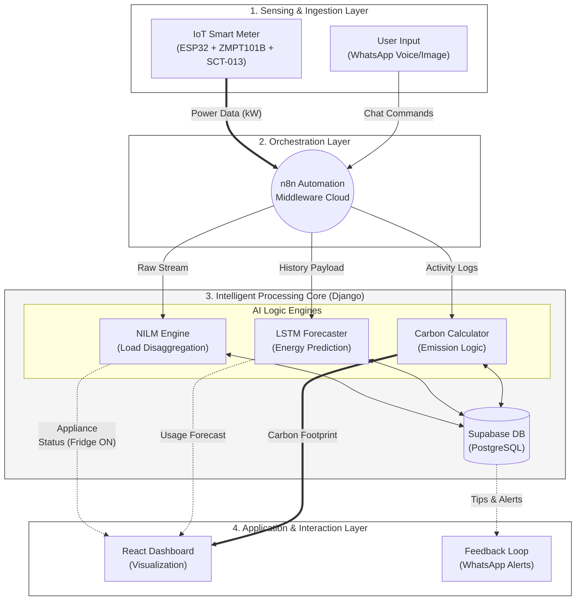

| [Main Project README](./README.md) | [Mathematical & NILM Report](./report.md) | [Satellite NO2 Detection Report](./SATELLITE_DETECTION_REPORT.md) | [IoT Hardware Schematics](./README.md#4-precision-iot-monitoring--hardware-edge-layer) |
|:---:|:---:|:---:|:---:|

# EcoTrack: IoT-Based Carbon Footprint Monitoring and Forecasting System

## 1. Mathematical Methodology

**A. Carbon Emission Calculation Model**
To quantify the environmental impact, we calculate the Carbon Dioxide Equivalent ($CO_2e$) based on real-time power consumption. The emission $CO_2e(t)$ at time $t$ is defined as:

$$
CO_2e(t) = P(t) \cdot \Delta t \cdot EF_{grid}
$$

Where:
*   $P(t)$ is the active power in kW measured by the ZMPT101B and SCT-013 sensors.
*   $\Delta t$ is the time interval (in hours).
*   $EF_{grid}$ is the Grid Emission Factor (currently $\approx 0.82 \, kgCO_2/kWh$ for the Indian grid).

**B. Non-Intrusive Load Monitoring (NILM)**
To identify specific connected components (e.g., Fridge vs. Fan) without individual sensors for each, we model the aggregate power $P_{total}(t)$ as the summation of individual appliance states:

$$
P_{total}(t) = \sum_{i=1}^{N} [s_i(t) \cdot P_i] + e(t)
$$

Where:
*   $N$ is the total number of appliances.
*   $s_i(t)$ represents the state (ON/OFF) of appliance $i$ at time $t$ (binary $\in \{0,1\}$).
*   $P_i$ is the power signature (nominal power) of appliance $i$.
*   $e(t)$ represents measurement noise or unknown loads.

**C. LSTM Forecasting Model**
For predicting future energy consumption, we utilize a Long Short-Term Memory (LSTM) network. The cell state $C_t$ and hidden state $h_t$ are updated as follows:

$$ f_t = \sigma(W_f \cdot [h_{t-1}, x_t] + b_f) $$
$$ i_t = \sigma(W_i \cdot [h_{t-1}, x_t] + b_i) $$
$$ C_t = f_t \odot C_{t-1} + i_t \odot \tanh(W_C \cdot [h_{t-1}, x_t] + b_C) $$
$$ h_t = \sigma(W_o \cdot [h_{t-1}, x_t] + b_o) \odot \tanh(C_t) $$

---

## 2. Comparative Analysis (Evaluation)

The table below highlights why EcoTrack is a novel approach compared to traditional methods found in the Indian market.

| Feature | **EcoTrack (Proposed)** | Traditional Smart Meter | Manual Calculators (Web) |
| :--- | :--- | :--- | :--- |
| **Data Acquisition** | **Hybrid** (IoT + AI Chatbot) | IoT Only | Manual Entry |
| **Granularity** | **Appliance-Level** (via NILM) | Whole-House Aggregate | Monthly Estimation |
| **Forecasting** | **LSTM-based** (Next 24h) | None (Historical only) | None |
| **User Interaction** | **Multimodal** (Voice/Image/Text) | Static LCD/App | Web Forms |
| **Gamification** | **Hardware-Verified XP** | None | None |
| **Cost** | **Low** (< ₹1,500) | High (> ₹5,000) | Free |

---

## 3. System Architecture Diagram (Figure 2)

**Title:** Functional Block Diagram of the EcoTrack System Architecture.

**Description:**
The system typically follows a three-column architecture flow:

1.  **Sensing Layer (Left):**
    *   **Sensors:** ZMPT101B (Voltage) and SCT-013 (Current) connected to the ESP32 Microcontroller.
    *   **Action:** Collects raw electrical signals and transmits them to the middleware.

2.  **Processing Layer (Middle):**
    *   **NILM Engine:** Takes raw power data $\rightarrow$ Outputs "Fridge ON".
    *   **LSTM Engine:** Takes historical data $\rightarrow$ Outputs "Predicted Usage".
    *   **Carbon Engine:** Takes usage $\rightarrow$ Outputs "$kgCO_2$".

3.  **Application Layer (Right):**
    *   **React Dashboard:** Visualizes graphs and stats.
    *   **WhatsApp Bot:** Sends alerts and tips.

### Figure 2: Block Diagram

